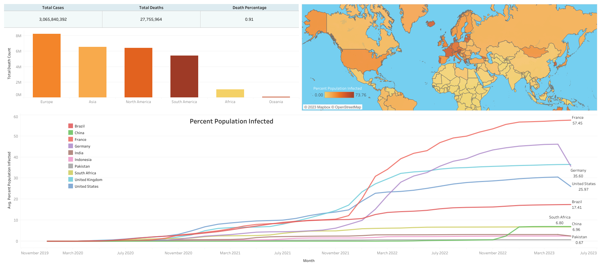

# Data Exploration and Visualization of Covid Data
## Goal of the project
The purpose of this project is to analyse the data of Covid 19 around the globe, which is divided into two main categories, Covid deaths and Covid Vaccination. Then after analyzation of covid related topics, visualize our finding into a dashboard. Main topics for our analyzation are:

Covid Infection rate around the globe, continents and countries.
Covid Death rate around the globe, continents and countries.
Covid Vaccination rate and percentage of rolling people vaccinated.

A Dashboard from this offical covid data is developed using **Tableau** and the data analysis is done using **SQL** to answer above topics, while **Excel** will serve as first repository and transforming of data.

# Tableau Dashboard
The interactive Dashboard based upon collected Covid Data from **01.01.2020** to **23.05.2023** is shown in image below while subsequent link is also atatched:

Click [here](https://public.tableau.com/app/profile/usama.zafar.qureshi/viz/Coviddata_16935098717520/Dashboard1?publish=yes) for the tableau dashboard.

# Data Processing
Data is got processed with the help of Excel by:

- dividing one single large available dataset into two tables based upon categories, covid death and covid vaccination while keeping location and date variables in both.

# Data Cleaning
Data is got cleaned with the help of SQL queries:

- Correcting date format for further easy SQL analysis in both separated datasets 
> To standardize the date columns format

```SQL
ALTER TABLE CovidDeaths
ADD DateConverted Date

UPDATE CovidDeaths
SET DateConverted = CONVERT(DATE, date)
```

```SQL
ALTER TABLE CovidVaccinations
ADD DateConverted Date

UPDATE CovidVaccinations
SET DateConverted = CONVERT(DATE, date)
```

- Finding and removing duplicates
>Finding duplicate rows using common table expression (CTE) and ROW_NUMBER() function.

>Using DELETE statement to remove the duplicate rows.

```SQL
WITH CTE AS 
(
	SELECT *, 
	ROW_NUMBER () OVER 
	(PARTITION BY location, DateConverted  ORDER BY location, DateConverted ) AS row_num
FROM CovidDeaths
)
SELECT *
FROM CTE
WHERE row_num > 1
```

```SQL
WITH CTE AS 
(
	SELECT *, 
	ROW_NUMBER () OVER 
	(PARTITION BY location, DateConverted  ORDER BY location, DateConverted ) AS row_num
FROM CovidVaccinations
)
SELECT *
FROM CTE
WHERE row_num > 1
```
In this statement:\
First, the CTE uses the ROW_NUMBER() function to find the duplicate rows specified by values in the location, date columns.\
Then, the DELETE statement deletes all the duplicate rows but keeps only one occurrence of each duplicate group.

- Droping unused columns from both separated datasets 

> To delete extra columns from datasets
```SQL
ALTER TABLE CovidDeaths
DROP COLUMN date, total_cases_per_million, new_cases_per_million,  new_cases_smoothed_per_million,total_deaths_per_million,
 new_deaths_per_million,new_deaths_smoothed_per_million,
 reproduction_rate,icu_patients,icu_patients_per_million,
 hosp_patients,hosp_patients_per_million,weekly_icu_admissions,
 weekly_icu_admissions_per_million,weekly_hosp_admissions,
 weekly_hosp_admissions_per_million
 ```

 ```SQL
 ALTER TABLE CovidVaccinations
DROP COLUMN date, handwashing_facilities, hospital_beds_per_thousand,
	life_expectancy,human_development_index, excess_mortality_cumulative_absolute, excess_mortality_cumulative,excess_mortality,
	excess_mortality_cumulative_per_million,total_boosters,new_vaccinations,
	new_vaccinations_smoothed, total_vaccinations_per_hundred,people_vaccinated_per_hundred,
	people_fully_vaccinated_per_hundred,total_boosters_per_hundred,new_vaccinations_smoothed_per_million,
	new_people_vaccinated_smoothed,new_people_vaccinated_smoothed_per_hundred,stringency_index,
	population_density,median_age,aged_65_older,aged_70_older```
```

# Analysis Approach
The following set of questions and topics will be stringed out from data.
Let’s load data into SQL and check the two tables to make sure it imported well.

> To see all columns of our datasets
```SQL
SELECT *
FROM CovidDeaths
ORDER BY location, DateConverted
```
```SQL
SELECT *
FROM CovidVaccinations
ORDER BY location, DateConverted
```

### 1.1 Country

#### 1.1.1 Infection Rate (Cases Percentage)
> To look at the total cases
```SQL
SELECT Location, DateConverted, total_cases, (total_cases/population) * 100 As CasesPercentage
FROM CovidDeaths
ORDER BY location, DateConverted
```
> Creating Cases Percentage column
```SQL
ALTER TABLE CovidDeaths 
ADD CasesPercentage FLOAT 

UPDATE CovidDeaths
SET CasesPercentage = (total_cases/population) * 100
```

#### 1.1.2 Death Rate (Death Percentage)

> To look at the total cases and total deaths
```SQL
SELECT Location, DateConverted, total_cases, total_deaths, (total_deaths/total_cases)*100 As DeathPercentage
FROM CovidDeaths
ORDER BY location, DateConverted
```
> Creating Death Percentage column
```SQL
ALTER TABLE CovidDeaths 
ADD DeathPercentage FLOAT 

UPDATE CovidDeaths
SET DeathPercentage = (total_deaths/total_cases) * 100
```

#### 1.1.3 Highest Infection Rate

> To look at the country with highest infection or cases count
```SQL
SELECT location, Population, MAX(total_cases) AS HighestInfectionCount
FROM CovidDeaths
WHERE continent IS NOT NULL
GROUP BY location, Population
ORDER BY HighestInfectionCount DESC
```

> To look at the country with highest infection rate as compare to its population
```SQL
SELECT location, Population, MAX( total_cases) AS HighestInfectionCount, 
ROUND(MAX(total_cases/population) * 100 , 2) AS PercenatagePopulationCases
FROM CovidDeaths
WHERE continent IS NOT NULL
GROUP BY location , Population
ORDER BY PercenatagePopulationCases DESC
```

> Creating Percenatage Population Cases column
```SQL
ALTER TABLE CovidDeaths 
ADD PercenatagePopulationCases FLOAT

UPDATE CovidDeaths 
SET PercenatagePopulationCases = (total_cases/ population)*100
WHERE continent IS NOT NULL
```

#### 1.1.4 Highest Death Percentage
> To look at the country with highest death count
```SQL
SELECT location,Population, MAX(total_deaths) AS HighestDeathCount
FROM CovidDeaths
WHERE continent IS NOT NULL
GROUP BY location, Population
ORDER BY HighestDeathCount DESC
```

> To look at the country with highest death rate as compare to its population
```SQL
SELECT location, Population, MAX( otal_deaths) AS HighestDeathCount, 
ROUND(MAX(total_deaths/population) * 100, 2) AS PercenatagePopulationDeath
FROM CovidDeaths
WHERE continent IS NOT NULL
GROUP BY location, Population
ORDER BY PercenatagePopulationDeath DESC
```

> Creating Percenatage Population Death column
```SQL
ALTER TABLE CovidDeaths 
ADD PercenatagePopulationDeath FLOAT

UPDATE CovidDeaths
SET PercenatagePopulationDeath = (total_deaths/population) * 100
WHERE continent IS NOT NULL
```

### 1.2 Continent

#### 1.2.1 Highest Infection Rate

> To look at the continent with highest cases count and percentage
```SQL
SELECT continent, ROUND(MAX(total_cases/population) * 100, 2) AS ContinentCasesPercentage
FROM CovidDeaths
WHERE continent IS NOT NULL
GROUP BY continent
ORDER BY ContinentCasesPercentage DESC 
```

> Creating Continent Cases Percentage column
```SQL
ALTER TABLE CovidDeaths 
ADD ContinentCasesPercentage FLOAT

UPDATE CovidDeaths
SET ContinentCasesPercentage = (total_cases/population) * 100
WHERE continent IS NOT NULL
```

#### 1.2.2 Highest Death Percentage

> To look at the continent with highest death count and percentage
```SQL
SELECT continent, MAX(total_deaths) AS HighestDeathCount, 
ROUND(MAX(total_deaths/population) * 100, 2) AS ContinentDeathPercentage
FROM CovidDeaths
WHERE continent IS NOT NULL
GROUP BY continent
ORDER BY ContinentDeathPercentage DESC 
```

> Creating Continent Death Percentage column
```SQL
ALTER TABLE CovidDeaths 
ADD ContinentDeathPercentage FLOAT

UPDATE CovidDeaths
SET ContinentDeathPercentage = (total_deaths/population) * 100
WHERE continent IS NOT NULL
```

### 1.3 Global

### 1.2.1 Death Rate

> To look at the total cases and death rate globally according to date
```SQL
SELECT DateConverted, SUM(new_cases) AS TotalCases , SUM(new_deaths) AS TotalDeaths, 
SUM(new_deaths)/NULLIF (SUM (new_cases),0) * 100 AS DeathRateGlobally
FROM CovidDeaths
WHERE continent is not null
GROUP BY DateConverted
ORDER BY 1
```

> Creating Death Rate GLobally column
```SQL
ALTER TABLE CovidDeaths 
ADD DeathRateGlobally FLOAT

UPDATE CovidDeaths
SET DeathRateGlobally = new_deaths/NULLIF ((new_cases),0) * 100
```

### 1.4 Vaccination

#### 1.4.1 Vaccination Count
- Total population that have been vaccinated
> To join both datasets
```SQL
SELECT *
FROM CovidDeaths AS dea
JOIN CovidVaccinations AS vac
ON dea.location = vac.location 
AND dea.DateConverted = vac.DateConverted
```

> To look at the total amount of people vaccinated per day
```SQL
SELECT dea.continent, dea.location, dea.dateconverted, dea.population, vac.new_vaccinations
FROM coviddeaths dea
JOIN covidvaccinations vac
	ON dea.location = vac.location
	AND dea.dateconverted = vac.dateconverted
WHERE dea.continent IS NOT NULL
ORDER BY 2,3
```
#### 1.4.2 Rolling People Vaccination 

> To show the added up vaccincation from each day
```SQL
SELECT dea.continent, dea.location, dea.dateconverted, dea.population, vac.new_vaccinations,
SUM(CAST(vac.new_vaccinations AS bigint)) 
OVER (PARTITION BY dea.location ORDER BY dea.location, dea.dateconverted) AS RollingPeopleVaccinated
FROM coviddeaths dea
JOIN covidvaccinations vac
	ON dea.location = vac.location
	AND dea.dateconverted = vac.dateconverted
WHERE dea.continent IS NOT NULL
ORDER BY 2,3
```

#### 1.4.2 Rolling People Vaccination Percentage
> To find the total vaccinated people as compare to the population by using CTE
```SQL
WITH PopvsVac (continent, location, DateConverted, population, new_vaccinations, RollingPeopleVaccinated) 
AS 
(
SELECT dea.continent, dea.location, dea.dateconverted, dea.population, vac.new_vaccinations,
SUM(CAST(vac.new_vaccinations AS bigint)) 
OVER (PARTITION BY dea.location ORDER BY dea.location, dea.dateconverted) AS RollingPeopleVaccinated
FROM coviddeaths dea
JOIN covidvaccinations vac
	ON dea.location = vac.location
	AND dea.dateconverted = vac.dateconverted
WHERE dea.continent IS NOT NULL 
)
SELECT * (RollingPeopleVaccinated/population)*100 AS PercentageRollingPeopleVaccinated
FROM PopvsVac
```

# Datasets Used
The datasets used:

- Comes with 1,245,804 rows with 1,245,803 being pure data and the other one row being the column headers.
- This coviddata recorded between 1st of January 2020 to 23th of May 2023.
- It contains the data all aroud the world.
- The data is publicly available through https://ourworldindata.org/covid-deaths
-  It appears the dataset may have been changed at the source. Please use these 2 links to get the data from the 2 excels:\

[1. Covid Deaths.xlsx](Data_files/CovidDeaths.xlsx)

[2. Covid Vaccination.xlsx](Data_files/CovidVaccinations.xlsx)

# Built with
- SQL Server Management Studio
- Tableau

# Authors
- Usama Qureshi - [Githun Profile](https://github.com/usamaqureshi27)
